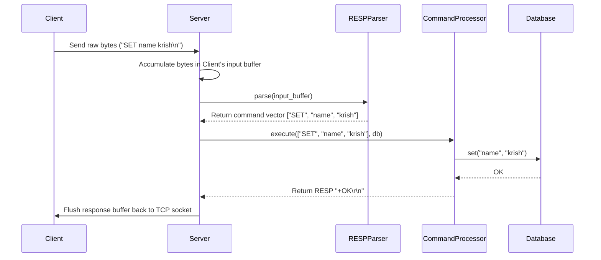

# Implementation Plan - Redis-Inspired Key-Value Database (Milestone 2)

This plan outlines the design and implementation for Milestone 2, which introduces a modular storage layer (`Database` class wrapping `std::unordered_map`) and implements standard key-value commands: `SET`, `GET`, `DEL`, and `EXISTS`.

---

## Architectural Layout

We maintain a strict separation of concerns to ensure the code remains clean, scalable, and interview-ready:

1. **Storage Layer (`Database`)**:
   - Fully decoupled from networking and RESP formatting.
   - Operates entirely on standard C++ types (`std::string`).
   - Uses `std::unordered_map<std::string, std::string>` under the hood.

2. **Routing / Execution Layer (`CommandProcessor`)**:
   - Registers handlers that accept the command arguments and a reference to the `Database` object.
   - Resolves case-insensitivity of commands.
   - Performs input syntax validation (argument counts).

3. **Parsing Layer (`RESPParser`)**:
   - Isolates the logic of reading and decoding RESP bytes or inline plain-text streams.
   - Formats return payloads using Redis-compliant type structures.

4. **Network Layer (`Server` / `Client`)**:
   - Handles low-level I/O multiplexing (`select()`).
   - Manages connection life cycles and tracks client memory buffers.
   - Triggers parsers and routers.

---

## Request Flow (Step-by-Step)

Here is how a client request is handled:



1. **TCP Read**: The `Server` wakes up on `select()` readability, calls `recv()` to extract bytes from the TCP connection, and appends them to the client's session buffer.
2. **Command Parsing**: The server calls `RESPParser::parse`. The parser detects standard RESP (e.g. `*3\r\n...`) or inline command strings (e.g. `SET name krish\n`), parses them into a `std::vector<std::string>`, and erases the parsed segment from the client's input buffer.
3. **Execution & Routing**: The server forwards the command vector and its `Database` instance to the `CommandProcessor`. The processor maps the command name (case-insensitively) to its handler.
4. **Storage Operations**: The handler executes the target database action (`set`, `get`, `del`, `exists`) using the standard string-based API of the `Database` class.
5. **Serialization**: The handler encodes the database result using RESP helpers (e.g. simple string `+OK\r\n` for `SET` and `DEL`, bulk string `$5\r\nkrish\r\n` for `GET`, integer `:1\r\n` for `EXISTS`).
6. **Flush**: The response is appended to the client's output buffer and written back to the socket.

---

## Folder Structure

```
d:/redis/
├── Makefile
└── src/
    ├── client.cpp
    ├── client.hpp
    ├── common.cpp
    ├── common.hpp
    ├── command.cpp
    ├── command.hpp
    ├── db.cpp             # [NEW] Storage engine class
    ├── db.hpp             # [NEW] Storage engine header
    ├── main.cpp
    ├── resp.cpp
    ├── resp.hpp
    ├── server.cpp
    └── server.hpp
```

---

## Proposed Changes

### [Storage Engine]
Creates the central data storage coordinator.

#### [NEW] [db.hpp](file:///d:/redis/src/db.hpp)
Declares the `Database` class holding the `std::unordered_map<std::string, std::string>` store and key operations.

#### [NEW] [db.cpp](file:///d:/redis/src/db.cpp)
Implements storage operations. We will add detailed, interview-friendly comments explaining choice of hash maps, time complexities ($O(1)$ average case), and RAII memory safety.

---

### [Command Router]
Links storage operations to registered network command keywords.

#### [MODIFY] [command.hpp](file:///d:/redis/src/command.hpp)
Modifies `CommandHandler` callback to take `Database& db` reference:
`using CommandHandler = std::function<std::string(const std::vector<std::string>&, Database&)>;`
Updates `execute()` signature to accept `Database& db`.

#### [MODIFY] [command.cpp](file:///d:/redis/src/command.cpp)
Adds handler implementations for `SET`, `GET`, `DEL`, and `EXISTS` commands:
- **`SET <key> <val>`**: Calls `db.set(key, val)` and returns `+OK\r\n`.
- **`GET <key>`**: Calls `db.get(key, val)`. If found, returns `$len\r\nval\r\n`; else returns `$-1\r\n`.
- **`DEL <key>`**: Calls `db.del(key)`. Returns `+OK\r\n` (per prompt specification).
- **`EXISTS <key>`**: Calls `db.exists(key)`. If found, returns `:1\r\n`; else returns `:0\r\n`.

---

### [TCP Server]
Holds database instance and threads it to command executions.

#### [MODIFY] [server.hpp](file:///d:/redis/src/server.hpp)
Includes `db.hpp` and adds a `Database db_;` member variable to the `Server` class.

#### [MODIFY] [server.cpp](file:///d:/redis/src/server.cpp)
Updates `handle_client_read()` to pass `db_` into `processor_.execute(cmd, db_)`.

---

### [Build System]

#### [MODIFY] [Makefile](file:///d:/redis/Makefile)
Appends `src/db.cpp` to the `SRCS` configuration.

---

## Verification Plan

### Automated Build Verification
Verify compilation via Makefile:
```bash
mingw32-make clean
mingw32-make
```

### Manual Protocol Verification
We will write a new test suite ([test_milestone_2.ps1](file:///C:/Users/ASUS/.gemini/antigravity-ide/brain/5bd94325-dea1-44ab-9ec1-5c7e4f8a73cf/scratch/test_milestone_2.ps1)) checking:
1. `SET name krish` -> returns `+OK`
2. `GET name` -> returns `krish`
3. `EXISTS name` -> returns `1`
4. `DEL name` -> returns `+OK`
5. `GET name` -> returns null (or `$-1`)
6. `EXISTS name` -> returns `0`
7. Key case-sensitivity (keys "name" and "Name" should be distinct)
8. Command case-insensitivity (`set` and `SET` should route identically)
9. Syntax validations (e.g. `SET` with missing values should return parameter count error)
